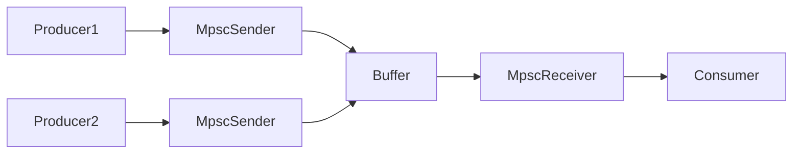
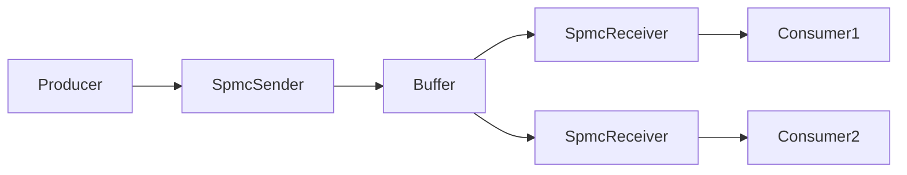
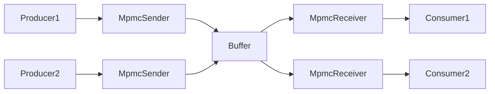

# 同步通道组件使用说明

本文档介绍位于命名空间 `lmshao::lmcore::sync` 的四类无锁有界通道组件及其使用方式：`SpscChannel`、`MpscChannel`、`SpmcChannel`、`MpmcChannel`，以及各自的端点类型 `SpscSender`/`SpscReceiver`、`MpscSender`/`MpscReceiver`、`SpmcSender`/`SpmcReceiver`、`MpmcSender`/`MpmcReceiver`。

## 引入与命名空间
- 头文件：`#include "lmcore/sync.h"`
- 命名空间：`lmshao::lmcore::sync`

## 统一设计与接口
- 通道通过工厂函数创建，返回发送端与接收端的智能指针对：
  - `SpscChannel<T>(size_t capacity) -> std::pair<std::unique_ptr<SpscSender<T>>, std::unique_ptr<SpscReceiver<T>>>`
  - `MpscChannel<T>(size_t capacity) -> std::pair<std::shared_ptr<MpscSender<T>>, std::unique_ptr<MpscReceiver<T>>>`
  - `SpmcChannel<T>(size_t capacity) -> std::pair<std::unique_ptr<SpmcSender<T>>, std::shared_ptr<SpmcReceiver<T>>>`
  - `MpmcChannel<T>(size_t capacity) -> std::pair<std::shared_ptr<MpmcSender<T>>, std::shared_ptr<MpmcReceiver<T>>>`
- 端点统一方法：
  - 生产者端（`*Sender`）：`TrySend(T)`、`Send(T)`、`Close()`、`IsClosed()`
  - 消费者端（`*Receiver`）：`TryRecv()`、`Recv()`、`IsEmpty()`、`IsClosed()`
- 阻塞语义：`Send()`/`Recv()` 采用无锁自旋 + `std::this_thread::yield()`；`TrySend()`/`TryRecv()` 为非阻塞。
- 所有端点类均不可拷贝/不可移动（继承 `NonCopyable`），只通过智能指针传递句柄。
- 构造函数私有化：端点对象只能由工厂函数创建。

## SPSC：单生产者、单消费者（性能最佳）
```cpp
#include "lmcore/sync.h"
using namespace lmshao::lmcore::sync;

auto [sender, receiver] = SpscChannel<int>(256);

std::thread prod([s = std::move(sender)]() mutable {
    for (int i = 0; i < 1000; ++i) {
        while (!s->TrySend(i)) { std::this_thread::yield(); }
    }
    s->Close();
});

std::thread cons([r = std::move(receiver)]() mutable {
    while (auto v = r->Recv()) {
        // 处理 v
    }
});

prod.join();
cons.join();
```

要点：
- 两端均是 `std::unique_ptr`，通过 `std::move` 将所有权移交到目标线程。
- 调用方需自行保证同一时间仅一个线程使用 `SpscSender` 的发送方法、仅一个线程使用 `SpscReceiver` 的接收方法。


## MPSC：多生产者、单消费者
```cpp
#include "lmcore/sync.h"
using namespace lmshao::lmcore::sync;

auto [tx, rx] = MpscChannel<std::string>(128);

// 多生产者：复制 shared_ptr 共享 sender
auto tx1 = tx;
auto tx2 = tx;

std::thread p1([tx1]() mutable { tx1->Send("P1"); });
std::thread p2([tx2]() mutable { tx2->Send("P2"); });

// 单消费者：receiver 是 unique_ptr
std::thread c([r = std::move(rx), tx]() mutable {
    tx->Close();
    while (auto msg = r->Recv()) { /* 处理 msg */ }
});

p1.join(); p2.join(); c.join();
```

要点：
- `MpscSender` 为 `std::shared_ptr`，可在多线程中复制共享；`MpscReceiver` 为 `std::unique_ptr`。
- 任一发送端调用 `Close()` 会关闭通道。



## SPMC：单生产者、多消费者
```cpp
#include "lmcore/sync.h"
using namespace lmshao::lmcore::sync;

auto [tx, rx] = SpmcChannel<int>(128);

// 单生产者：tx 是 unique_ptr
std::thread p([t = std::move(tx)]() mutable { t->Send(42); t->Close(); });

// 多消费者：复制 shared_ptr 共享 receiver
auto rx1 = rx, rx2 = rx;
std::thread c1([rx1]() mutable { while (auto v = rx1->Recv()) { /* ... */ } });
std::thread c2([rx2]() mutable { while (auto v = rx2->Recv()) { /* ... */ } });

p.join(); c1.join(); c2.join();
```

要点：
- `SpmcSender` 为 `std::unique_ptr`；`SpmcReceiver` 为 `std::shared_ptr`，可在多线程共享。
- 每条消息只会被一个消费者接收。



## MPMC：多生产者、多消费者
```cpp
#include "lmcore/sync.h"
using namespace lmshao::lmcore::sync;

auto [tx, rx] = MpmcChannel<int>(128);

auto tx1 = tx, tx2 = tx;   // 共享 sender
auto rx1 = rx, rx2 = rx;   // 共享 receiver

std::thread p1([tx1]() mutable { tx1->Send(1); });
std::thread p2([tx2]() mutable { tx2->Send(2); });

std::thread c1([rx1]() mutable { while (auto v = rx1->Recv()) { /* ... */ } });
std::thread c2([rx2]() mutable { while (auto v = rx2->Recv()) { /* ... */ } });

p1.join(); p2.join(); tx->Close(); c1.join(); c2.join();
```

要点：
- 两端均为 `std::shared_ptr`，生产者/消费者都可并发。



## 行为与最佳实践
- 背压：队列满时 `TrySend()` 返回 false。常见策略：
  - 自旋等待：短暂 `yield()` 后重试（低延迟场景）
  - 丢弃策略：视频/实时场景可选择丢弃新数据或旧数据（由业务决定）
  - 限速：上游降速或批量处理
- 关闭：建议由生产者端在退出前调用 `Close()`；消费者端在 `Recv()` 返回空（通道关闭且缓冲区清空）后退出。
- 能见性与内存序：内部使用 `acquire/release` 保证跨线程可见性，无额外锁；`Send()`/`Recv()` 的自旋适合低延迟负载。

## 小结
- 根据并发角色选择通道类型：`SpscChannel`（单/单）、`MpscChannel`（多/单）、`SpmcChannel`（单/多）、`MpmcChannel`（多/多）。
- 严格遵守端点的智能指针语义与并发约束，避免值拷贝。
- 统一 API 让迁移与替换简单明了，适合通用任务与实时场景。
